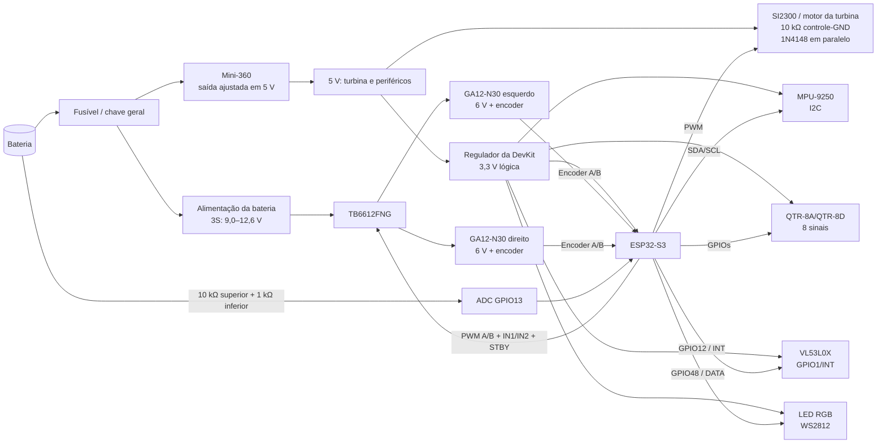

# Hardware — Aspirador de Pista

Este documento descreve os materiais e as ligações elétricas atualmente refletidos no firmware. Ele serve como referência para montagem, manutenção e publicação do projeto no GitHub.

> **Atenção:** o motor especificado é o **GA12-N30 6 V**. Ele deve ser alimentado pela tensão do conjunto de potência (aproximadamente 6 V), através do driver TB6612FNG. Nunca ligue o motor diretamente a um GPIO do ESP32-S3.

## Materiais

| Qtde. | Componente | Especificação / função |
|---:|---|---|
| 1 | Microcontrolador | **ESP32-S3-DevKitC-1** com USB e BLE |
| 2 | Motorredutor | **GA12-N30, 6 V**, com encoder incremental, um para cada lado |
| 1 | Driver de motores | **TB6612FNG**, ponte H dupla, canais A/B e entrada `STBY` |
| 1 | Driver do motor da turbina | **SI2300** ou módulo equivalente, acionado por PWM e sem controle de direção |
| 1 | Resistor de pull-down | **10 kΩ** entre o pino de controle/gate do driver da turbina e GND |
| 1 | Diodo de proteção | **1N4148**, em paralelo com os terminais do motor da turbina |
| 1 | Sensor de linha | **QTR-8A/QTR-8D** ou placa equivalente com 8 canais |
| 1 | IMU | **MPU-9250** (acelerômetro, giroscópio e magnetômetro) |
| 1 | Sensor de distância/portal | Módulo **VL53L0X**, usando a saída de interrupção `GPIO1/INT` |
| 1 | LED RGB endereçável | LED compatível com protocolo WS2812, sinal em um único fio |
| 1 | Bateria | **LiPo 3S, 300 mAh**; tensão nominal de 11,1 V e máxima de 12,6 V |
| 1 | Regulador DC-DC | **Mini-360**, ajustado para **5 V**, alimentando o motor da turbina e os periféricos conforme a montagem |
| 2 | Resistores do divisor | **10 kΩ + 1 kΩ** para medição da bateria no ADC |
| 1 | Chave geral e proteção | Interruptor, fusível/disjuntor e proteção contra inversão de polaridade |
| — | Capacitores de desacoplamento | 100 nF junto aos CI/sensores e eletrolítico próximo ao driver e aos motores |
| — | Fiação e conectores | Cabos de potência separados dos cabos de sinais, terminais e parafusos |

O valor exato do módulo do motor da turbina deve ser confirmado conforme a montagem física. O firmware apenas define os limites elétricos e os sinais de controle; ele não substitui a validação da alimentação.

## Esquemático funcional



Todos os módulos devem compartilhar **GND**. O retorno dos motores deve usar um caminho de potência curto e separado do retorno dos sensores; una os terras em um ponto comum próximo à alimentação/driver para reduzir ruído no ADC, na IMU e nos encoders.

O Mini-360 deve receber a bateria 3S e ser ajustado com multímetro para 5,0 V antes de conectar a turbina ou os periféricos. A entrada `5V` da ESP32-S3-DevKitC-1 deve receber somente uma fonte de 5 V regulada; não conecte a bateria 3S diretamente nessa entrada.

## Pinagem do ESP32-S3

### Motores, driver e encoders

| Sinal | GPIO | Ligação |
|---|---:|---|
| `PWMA` motor esquerdo | 39 | `TB6612 AIN/PWMA` |
| `AIN1` motor esquerdo | 40 | `TB6612 AIN1` |
| `AIN2` motor esquerdo | 41 | `TB6612 AIN2` |
| `PWMB` motor direito | 1 | `TB6612 BIN/PWMB` |
| `BIN1` motor direito | 2 | `TB6612 BIN1` |
| `BIN2` motor direito | 42 | `TB6612 BIN2` |
| `STBY` | 36 | `TB6612 STBY` |
| Encoder esquerdo A/B | 35 / 14 | Saídas A/B do GA12-N30 esquerdo |
| Encoder direito A/B | 21 / 5 | Saídas A/B do GA12-N30 direito |
| PWM motor da turbina | 4 | Gate/entrada do SI2300 |

Configuração atual: PWM em 25 kHz, resolução de 10 bits, quadratura 4x e amostragem dos encoders em 1000 Hz.

### Sensores e sinalização

| Sinal | GPIO | Interface |
|---|---:|---|
| QTR canal 1…8 | 6, 16, 7, 8, 9, 10, 11, 15 | Leitura RC do sensor de linha |
| MPU-9250 SDA/SCL | 17 / 18 | I2C, endereço MPU `0x68` |
| VL53L0X `GPIO1/INT` | 12 | Entrada de interrupção, ativa em nível baixo |
| Medição da bateria | 13 | ADC2 canal 2 através de divisor resistivo |
| LED RGB | 48 | Dados do LED endereçável |

## Ligações do TB6612FNG

| TB6612FNG | Conectar em |
|---|---|
| `VM` | Barramento dos motores GA12-N30; confirmar se será bateria direta ou uma saída regulada compatível com o motor |
| `VCC` | 3,3 V da lógica |
| `GND` | GND comum |
| `A01/A02` | Motor GA12-N30 esquerdo |
| `B01/B02` | Motor GA12-N30 direito |
| `PWMA`, `AIN1`, `AIN2` | GPIO 39, 40, 41 |
| `PWMB`, `BIN1`, `BIN2` | GPIO 1, 2, 42 |
| `STBY` | GPIO 36; deve estar em nível alto para habilitar o driver |

Coloque um capacitor de baixa impedância próximo de `VM/GND` do driver e, se os cabos dos motores forem longos, capacitores de supressão nos terminais dos motores. Verifique a corrente de travamento do GA12-N30 antes de escolher o fusível e confirme que ela está dentro do limite do TB6612FNG.

### Circuito da turbina

O controle da turbina usa um resistor de **10 kΩ entre o pino de controle do SI2300 e GND**. Esse resistor mantém o driver desligado durante o boot, reset ou quando o GPIO estiver em alta impedância.

O diodo **1N4148** deve ser instalado diretamente entre os terminais do motor, com o **cátodo no terminal positivo do motor** e o **ânodo no terminal negativo**, considerando o sentido normal de alimentação. Ele absorve o pico de tensão gerado quando o PWM desliga a corrente da bobina do motor. Mantenha os fios do diodo curtos e próximos ao motor ou ao driver.

Esse arranjo presume que a turbina gira em um único sentido. Se o circuito passar a inverter a polaridade do motor, o 1N4148 não deve ser ligado dessa forma; nesse caso será necessário um circuito de proteção bidirecional apropriado.

Referência do componente: [diodo 1N4148](https://pt.aliexpress.com/item/1005002340232205.html).

## Medição da bateria

Use o resistor de **10 kΩ entre a bateria e o GPIO13** e o resistor de **1 kΩ entre o GPIO13 e o GND**. Com a bateria em 12,6 V, o ADC recebe aproximadamente:

```text
V_ADC = 12,6 V × 1 kΩ / (10 kΩ + 1 kΩ) ≈ 1,15 V
```

Esse valor fica abaixo de 3,3 V. Solde os resistores próximos à placa, adicione um capacitor pequeno do GPIO13 para GND se houver ruído e confirme a leitura real com multímetro. O firmware deve usar a mesma relação do divisor ao converter o ADC em tensão da bateria.

## Encoders e odometria

Cada GA12-N30 deve fornecer os sinais de quadratura A e B. A configuração atual considera 11 pulsos por volta do eixo do motor, redução 6:1 e decodificação 4x, totalizando 264 contagens por volta do eixo de saída. A odometria é atualizada internamente a 1000 Hz; a frequência de telemetria BLE pode ser reduzida na página **Telemetria BLE** da interface.

Se o encoder instalado tiver outra resolução ou redução, ajuste `components/encoder/include/encoder_config.h` e calibre também a distância entre rodas e o diâmetro efetivo das rodas.

## Checklist de montagem

- Confirmar a polaridade dos dois motores e dos encoders antes de fechar a carcaça.
- Medir a saída do regulador sem o ESP32 conectado.
- Confirmar que o divisor da bateria produz no máximo 3,3 V no GPIO13 na tensão máxima da bateria.
- Testar o `STBY` e cada canal do TB6612 com os motores suspensos.
- Manter os motores parados durante o primeiro teste BLE.
- Calibrar IMU, sensor de linha e odometria depois da montagem final.
- Usar a função de parada da interface antes de desconectar a bateria ou o BLE.

## Itens que precisam ser confirmados na montagem física

Para transformar este documento em um esquema elétrico definitivo, ainda faltam o modelo específico do módulo do SI2300, o modelo do QTR/VL53L0X e a confirmação de como os GA12-N30 serão alimentados. Esses itens podem alterar conectores e limites de corrente, embora não mudem a pinagem de firmware documentada acima.
